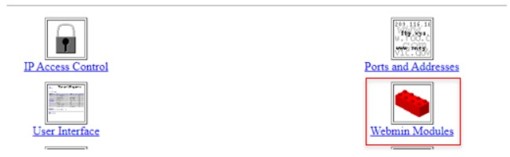
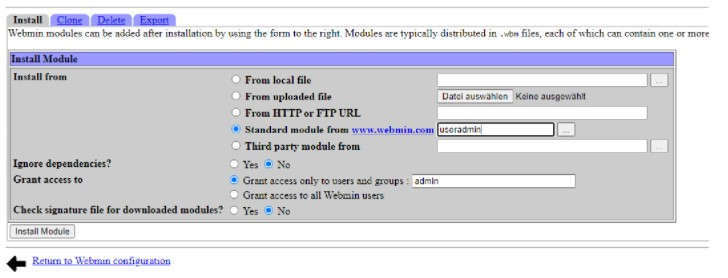

# M306-Service
# Werkstattauftrag W07-Webmin

# Inhaltsverzeichnis:
- [M306-Service](#m306-service)
- [Werkstattauftrag W07-Webmin](#werkstattauftrag-w07-webmin)
- [Inhaltsverzeichnis:](#inhaltsverzeichnis)
    - [1. **Autoren, Versionierung des Dokumentes**](#1-autoren-versionierung-des-dokumentes)
    - [2. **Einfuehrung**](#2-einfuehrung)
      - [2.1 **Was kann die Software**](#21-was-kann-die-software)
      - [2.2 **Vorgesehener Zeitaufwand**](#22-vorgesehener-zeitaufwand)
      - [2.3 **Mögliche Risiken und Stolpersteine**](#23-mögliche-risiken-und-stolpersteine)
    - [3. **Benoetigte Hard- und Software**](#3-benoetigte-hard--und-software)
    - [4 **Installationsanleitungen**](#4-installationsanleitungen)
      - [4.1 **Installationsanleitung (für die Lehrperson)**](#41-installationsanleitung-für-die-lehrperson)
        - [Installieren von extra Modulen](#installieren-von-extra-modulen)
      - [**4.2 Installationsanleitung (für die Lernenden)**](#42-installationsanleitung-für-die-lernenden)
        - [Installieren von extra Modulen](#installieren-von-extra-modulen-1)
    - [5. **Qualitaetskontrolle**](#5-qualitaetskontrolle)
    - [6. **Error-Handling**](#6-error-handling)
    - [7. **Quellen**](#7-quellen)
    - [8. **OpenSource Lizenz**](#8-opensource-lizenz)

### 1. **Autoren, Versionierung des Dokumentes**
Verison 1.0; 28.09.2021; Joel Koch & Yanis Blust
<br> Version 1.1; 5.10.2021; Joel Koch & Yanis Blust

### 2. **Einfuehrung**
#### 2.1 **Was kann die Software**
Webmin ist ein Werkzeug/Software mit dem man ein Linux Server mit einem Browser verwalten kann. So kann man in Webmin verschiedene Module installieren mit denen man dann z.B die User verwalten kann. Auch kann man verschiedene Server Daemons konfigurieren wie z. B einen Apache Webserver oder DNS.

#### 2.2 **Vorgesehener Zeitaufwand**
Unser Zeitbudget ist auf 7 Lektion beschränkt. Unser vorgesehener Zeitaufwand nutzt genau die 7 Lektionen aus. Eins unserer Ziele ist, diese 7 Lektionen nicht zu überziehen und allfällige aufgaben von zuhause zu erledigen.

#### 2.3 **Mögliche Risiken und Stolpersteine**
- Das grösste Risiko/Gefahr ist für uns das Versagen der Hardware, einerseit, wissen wir nicht in welchen zustand sich der Raspberry Pi befindet. Aus Erfahrung können wir auch sagen, dass das Netzwerk nicht immer Stabil ist, dies kann auch noch zu Problemen führen.
- Was auch zu einen Störungsfaktor werden kann, ist Git und Markdown selber. Wir beide sind relativ neu auf diesem Gebiet un müssen uns selbst noch richtig einarbeiten.


### 3. **Benoetigte Hard- und Software**
**Hardware:**
Unsere Wichtigste Hardware ist der Raspberry Pi, auf diesem wird das Webmin installiert und Konfiguriert. Unsere eigene Laptops sind auch noch ein wichtiges Glied unsere Hardware, nachdem auf dem Raspberry Pi VNC installiert ist, brauchen wir keinen zusätzlichen Bildschirm mehr und wir können von unseren eigenen Notebooks den Raspberry Pi fernverwalten.
<br> 1x HDMI auf MikroHDMI stecker
<br> 1x Micro SSD als Festplatte für den Raspi

**Software:**
Die benötigte Software, welche wir genutzt haben, sind VNC und ein ISO-File für das Raspberry Pi OS. 
    <br>VNC, Virtual Network Computing,  ist eine Software, die den Bildschirminhalt eines entfernten Rechners auf einem lokalen Rechner anzeigt und im Gegenzug Tastatur- und Mausbewegungen des lokalen Rechners an den entfernten Rechner sendet
        

### 4 **Installationsanleitungen**
#### 4.1 **Installationsanleitung (für die Lehrperson)**
Die Installation von Webmin erfolgt über die Kommandozeile und ist relativ einfach zu erledigen. Als aller erstes führen wir diesen Befehl aus:
````sudo apt-get install libnet-ssleay-perl libio-socket-ssl-perl````
 
Danach gehen wir auf die folgende Webseite

````https://sourceforge.net/projects/webadmin/files/webmin````

und suchen uns die neueste Version der minimale Version.
Zu meinem Zeitpunkt war die neueste Version 1.973. 
Im Command einfach die neueste Version einsetzen.

````cd````

````wget http://prdownloads.sourceforge.net/webadmin/webmin-1.973-minimal.tar.gz````
 
Das Tar Archiv dass wir nun heruntergeladen haben, entpacken wir mit folgendem Command.

````tar-zxvf webmin-1.973-minimal.tar.gz````

Jetzt wechseln wir in das Verzeichnis von Webmin und führen die Installation durch.

````cd webmin-1.973````
````sudo ./setup.sh````
 
Nun kommen im Shell ein paar Fragen die man alle auf Default lassen kann. Das Passwort muss man natürlich setzen. Nachdem die Installation fertig ist kann man die letzte Frage noch mit “Y” bestätigen damit Webmin automatisch beim start des Systems startet.
 
Mit diesen Daten kommt man auf die Webmin Webpage:
````http://hostname:10000/````

##### Installieren von extra Modulen
Nun erstellen wir das Extra Modul Useradmin, damit wir Benutzer erstellen und verwalten können. Für die Installation von Modulen geht man von der Homepage aus auf → Webmin Configuration → Webmin Modules.


Das installieren von Modulen ist sehr einfach. Das Modul “useradmin” kann man so installieren:


#### **4.2 Installationsanleitung (für die Lernenden)**
Die Installation von Webmin erfolgt über die Kommandozeile und ist relativ einfach zu erledigen.

Installieren sie folgende Packages:
````libnet-ssleay-perl libio-socket-ssl-perl````
 
Wenn diese Installiert sind, gehen sie auf die Webseite von Sourceforge und suchen sie nach der neuesten minimalen Version.
````https://sourceforge.net/projects/webadmin````

Zum Zeitpunkt der Erstellung dieser Dokumentation war *1.973* die neueste Version.

Danach wechseln wir das Verzeichnis und laden Webmin mit dieser URL herunter:
````cd````

````http://prdownloads.sourceforge.net/webadmin/webmin-1.973-minimal.tar.gz````
 
Das Tar Archiv dass wir nun heruntergeladen haben, entpacken wir mit folgendem Command. *TIPP: TAR Googlen*

Jetzt wechseln wir in das Verzeichnis von Webmin und führen die Installation durch mit folgendem Command durch.

````sudo ./setup.sh````
 
Nun startet die Installation im Shell, diese kann man einfach nach den Vorgaben durchführen. 
*Wichtig: Die letzte Frage mit "JA" beantworten, damit Webmin beim Start auch mit aufstartet.*
 
Danach gehen wir auf den Browser ihrer Wahl und auf unseren Server + den Port 10'000.

##### Installieren von extra Modulen
Nun erstellen wir das Extra Modul Useradmin, damit wir Benutzer erstellen und verwalten können. Für die Installation geht man zu Webmin Modules.


Das installieren von Modulen ist sehr einfach.
Suchen sie im neuen Fenster nach dem Modul Useradmin und installieren sie dieses.

Fertig nun haben sie schon das Modul useradmin auf ihrem Webmin installiert. Jetzt haben sie ein Tool mit dem sie User erstellen, verwalten und konfigurieren.

### 5. **Qualitaetskontrolle**
**Status von Webmin Prüfen:**
<br> ````sudo service webmin````

**Webmin starten/restarten**
<br> ````sudo/etc/webmin/start````

**sudo service**
<br> ````webmin restart````

**Webmin Stoppen**
<br> ````sudo service webmin stop````

### 6. **Error-Handling**
Bei der Installation hatten wir keine Probleme.

### 7. **Quellen**
- Eigene Dokumentation aus dem Modul 126.
- VNC für Raspi: https://www.realvnc.com/de/connect/download/viewer/raspberrypi/
- Raspberry Pi Os: https://www.raspberrypi.org/software/ 

### 8. **OpenSource Lizenz**
<a rel="license" href="http://creativecommons.org/licenses/by-nc-sa/4.0/"></a><br />Dieses Werk ist lizenziert unter einer <a rel="license" href="http://creativecommons.org/licenses/by-nc-sa/4.0/">Creative Commons Namensnennung - Nicht-kommerziell - Weitergabe unter gleichen Bedingungen 4.0 International Lizenz</a>.
